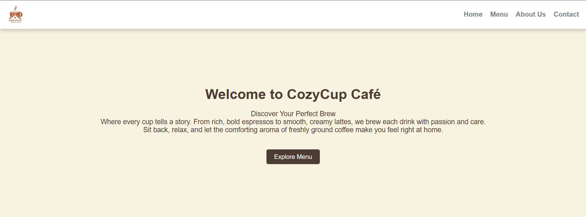
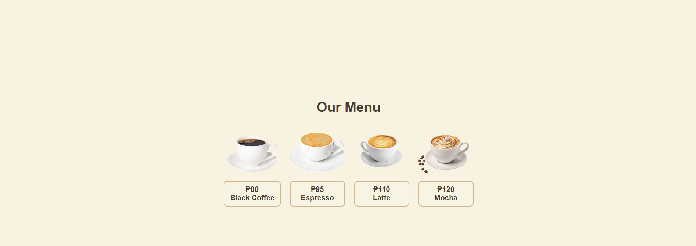
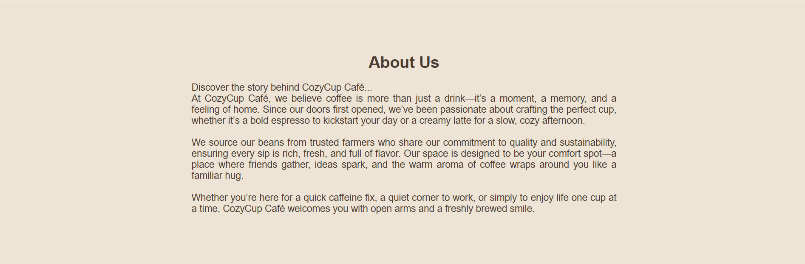

# Cozy Cup Cafe
### Project Description
Cozy Cup Cafe is a simple project that showcases a warm and welcoming cafe concept, highlighting freshly brewed coffee, tasty pastries, and a relaxing atmosphere for everyone to enjoy. :wink: :wink: 
### Features
* User Friendly
* Responsive Navigation Bar
* Clean and Detailed Design
* Menu Section
* Header & Footer

### Screen Captures

*This is the **Home Page**, featuring the welcome message, navigation bar and the brand logo.*

*The **Menu Section** displays the products and prices.*

*The **Menu Section** displays the products and prices.*

*The **Contact Section** allows the clients to reach out the cafe personnel easily via email.*

_____

### About the Author

**germancinco71**  
**germancinco17@gmail.com**  

 &nbsp&nbsp

